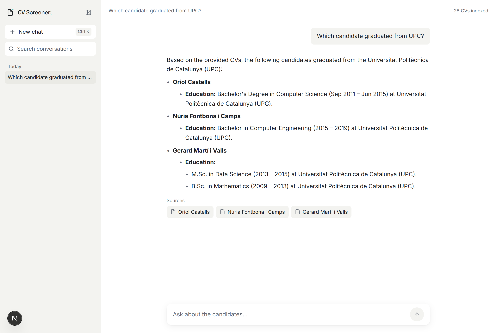
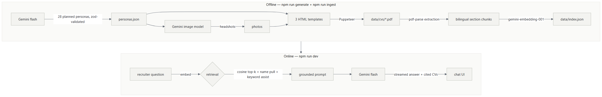
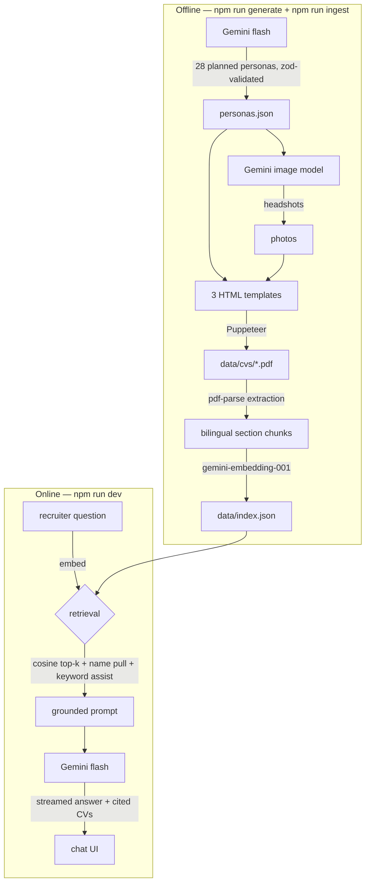

# CV Screener

I built an AI-powered CV screening prototype: 28 generated candidate CVs
(PDFs with photos, in English and Spanish, across three visual templates), a
RAG pipeline built directly on the PDF text, and a chat interface that
answers recruiter questions grounded **only** in the CVs — with source
citations on every answer and conversation history saved locally. Everything
runs on a single Gemini API key.



## Architecture



<details>
<summary>Mermaid source</summary>



</details>

## Run it

1. **Prerequisites:** Node **20.16+ or 22.3+** (pdf-parse, the PDF text
   extractor, requires `>=20.16 <21 || >=22.3`) and npm.
2. **Install:**

   ```bash
   npm install
   ```

   This also downloads Chromium (~150 MB) for Puppeteer. Puppeteer is only
   exercised if you regenerate the corpus — running the app doesn't need it.
3. **API key:** copy `.env.example` to `.env` and set `GOOGLE_API_KEY`. A
   free key takes a minute at <https://aistudio.google.com/apikey>.
4. **Start:**

   ```bash
   npm run dev
   ```

   Open <http://localhost:3000>. The 28 CV PDFs (`data/cvs`) **and** the
   prebuilt vector index (`data/index.json`) ship with this archive, so no
   generation or ingestion is required — the app answers questions
   immediately.

### Rebuilding from scratch (optional)

- `npm run generate` — three stages: `personas` asks Gemini for 28 planned
  candidate profiles and validates them with zod; `photos` generates one
  AI headshot per candidate; `pdfs` renders each persona through one of
  three HTML templates into an A4 PDF with Puppeteer. Stages run
  individually via `npm run generate -- --stage personas|photos|pdfs`.
  Note: the photo stage calls the Gemini image API, which has no free-tier
  quota and may require a key with billing enabled.
- `npm run ingest` — extracts text from the PDFs, chunks it by section,
  embeds the chunks, and rewrites `data/index.json`.

## How it works

**Generation.** I plan the 28 personas in code — the exact role mix,
22 English / 6 Spanish CVs, exactly three UPC graduates, seven candidates
with Python — and have Gemini flesh each spec into a full profile, validated
against a zod schema with retries. Each persona is rendered through one of
three HTML templates (classic serif, dark sidebar, modern minimal) so the
corpus looks organically varied rather than uniform, then printed to A4 PDF
with Puppeteer.

**Ingestion.** The index is built from the PDFs themselves, never from the
source JSON: pdf-parse extracts the text, and a section splitter detects the
headings (in both English and Spanish — the templates and the ingester share
one heading table) to cut each CV into summary, skills, experience-per-job,
education, languages and contact chunks. Every chunk is prefixed with its
candidate and section so retrieved excerpts are self-describing, then
embedded with gemini-embedding-001 into a plain JSON file.

**Retrieval.** Pure vector top-k fails two recruiter question shapes:
profile questions ("summarize X") need the whole CV, and aggregate questions
("who knows Python?") drown among 15 semantically similar CVs. So cosine
top-k is merged with a full-CV pull for any candidate named in the question
and an exact keyword assist for discriminative terms — a frequency guard and
a stopword list keep generic words from firing. The merge caps context
fairly, round-robin per candidate, so one long CV can never crowd another
matching candidate out.

**Grounding and citations.** The excerpts go into a strict system prompt
that forbids answering beyond them; the answer streams back over NDJSON.
The source chips under each answer are the CVs the answer actually names —
retrieved-but-unused context is not presented as a source, and a "not in the
CVs" refusal shows no chips. Conversations persist to versioned
localStorage, per completed turn only.

## Design decisions & limitations

- **Hand-rolled vector store.** The index is a JSON file scanned with a
  30-line cosine-similarity search. For 28 documents (~200 chunks) a vector
  database adds operational surface without adding capability; keeping the
  search hand-written makes every retrieval step transparent and debuggable.
- **One provider, no frameworks.** Chat, embeddings and images all come
  from the Gemini REST API through one thin fetch client with retry and
  backoff; no LangChain, no SDK indirection. Fewer moving parts to explain.
- **In-memory index.** Fine for hundreds of chunks; not a design for
  thousands of CVs.
- **Free-tier rate limits are real.** Generation and ingestion back off and
  retry on 429s; the chat surfaces rate-limit errors with a retry button.
- **Chat history is localStorage-only.** Conversations live in the browser,
  per device — deliberate for a prototype with no accounts or server state.
- **Synthetic data.** Contact details use fake domains and numbers;
  companies are invented; the photos are AI-generated.

## Repo layout

```
scripts/generate-cvs.ts   personas -> photos -> PDFs (three --stage steps)
scripts/ingest.ts         PDFs -> section chunks -> embeddings -> index.json
lib/gemini.ts             thin Gemini REST client (chat+stream, embed, image)
lib/vectorstore.ts        load index.json, cosine similarity, top-k
lib/retrieval.ts          two-path retriever (vector + name pull + keywords)
lib/schemas.ts            zod contracts: Persona, Chunk
lib/sections.ts           bilingual section-heading table (shared by both sides)
templates/                three CV HTML templates
app/api/chat/route.ts     RAG endpoint: retrieve -> grounded stream -> sources
app/cvs/[file]/route.ts   serves the PDF corpus for source chips
components/               chat UI: sidebar, composer, markdown, logo
data/                     personas.json, cvs/, index.json (all included)
```
